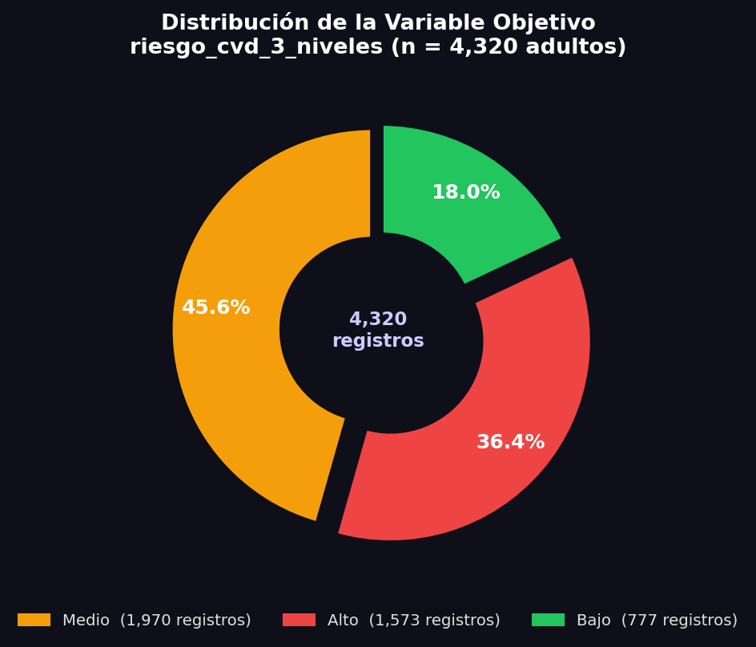
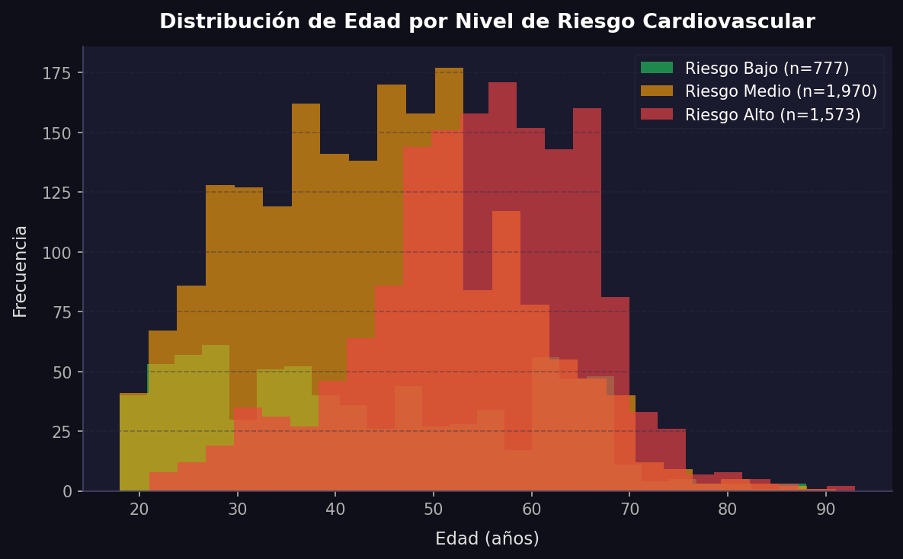
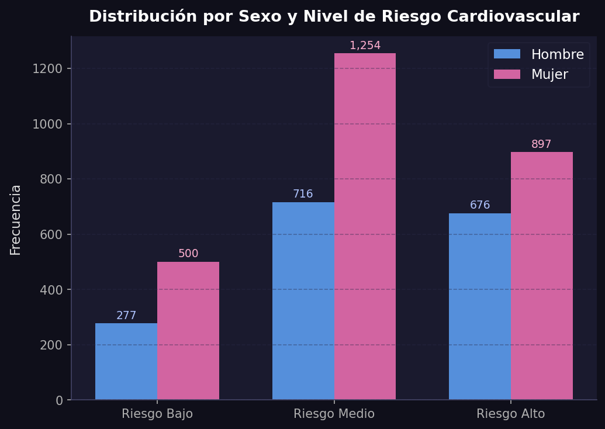
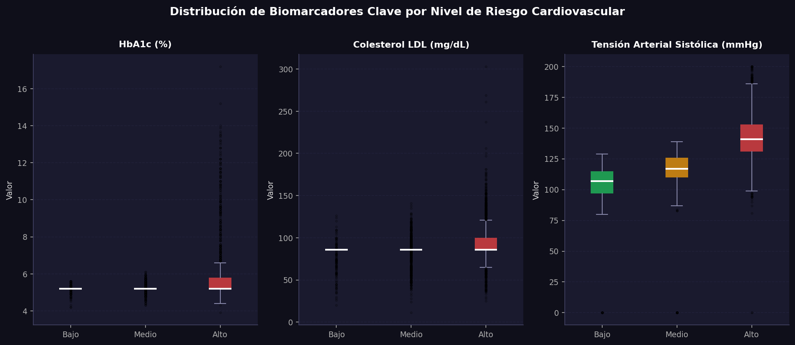
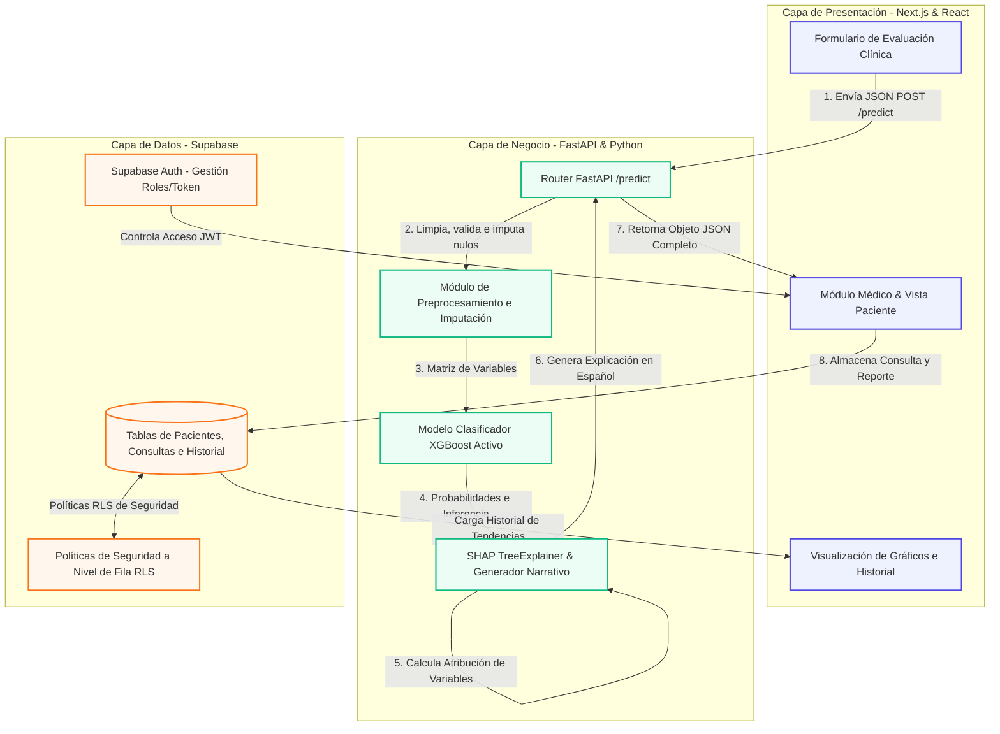

# DOCUMENTO CONSOLIDADO DE TESIS: CAPÍTULO 3 Y CAPÍTULO 4

Este documento contiene la redacción académica detallada y completa del **Capítulo 3 (Diseño del Sistema y Metodología)** y la sección teórica/estadística del **Capítulo 4 (Resultados)**, adaptada al proyecto **CardioPredict CDSS**. El texto mantiene un nivel de rigor académico formal e incorpora ecuaciones en LaTeX, diagramas en Mermaid.js y referencias a las figuras estadísticas y de arquitectura del proyecto.

---

# CAPÍTULO 3: METODOLOGÍA Y DISEÑO DEL SISTEMA

## 3.1 Introducción al Diseño Metodológico
El desarrollo del Sistema de Soporte de Decisiones Clínicas (CDSS) para la estratificación del riesgo cardiovascular se basa en un enfoque de investigación aplicada y experimental. El objetivo fundamental consiste en integrar un clasificador predictivo basado en aprendizaje automático (Machine Learning) con una plataforma web interactiva y segura para uso en consultorios médicos. La metodología abarca desde la adquisición y el preprocesamiento del conjunto de datos nacionales, pasando por el diseño algorítmico y la validación del modelo, hasta la integración arquitectónica y el diseño detallado de las interfaces de usuario.

---

## 3.2 Población y Muestra (Dataset de Estudio)

### 3.2.1 Descripción y Origen de la Fuente de Datos
El dataset empleado proviene de la **Encuesta Nacional de Salud y Nutrición Continua 2022 (ENSANUT Continua 2022)**, ejecutada por el **Instituto Nacional de Salud Pública (INSP)** en colaboración con la Secretaría de Salud de México. Esta encuesta representa el instrumento estadístico de mayor representatividad epidemiológica en México, y cuenta con un diseño probabilístico, estratificado y polietápico para capturar de manera fidedigna el estado nutricional y de salud de la población.

Para fines de desarrollo, se accedió al dataset a través del repositorio público de **Kaggle**, publicado por **Axel Frederick Félix Jiménez** bajo el título *"Hipertension Arterial Mexico Data Set"*, con licencia **Creative Commons CC BY 4.0**:

> 🔗 [https://www.kaggle.com/datasets/frederickfelix/hipertensin-arterial-mxico](https://www.kaggle.com/datasets/frederickfelix/hipertensin-arterial-mxico)

El autor consolidó e integró tres módulos originales de la ENSANUT 2022 vinculados mediante la clave única de registro `FOLIO_I`:
1.  **Antropometría y tensión arterial (`ensaantro2022_entrega_w.csv`):** Contiene peso, estatura, circunferencia de cintura, mediciones de tensión arterial sistólica y diastólica, y determinación de hemoglobina capilar.
2.  **Determinaciones bioquímicas (`Determinaciones_bioquimicas_cronicas_deficiencias_9feb23.csv`):** Contiene glucosa en ayunas, hemoglobina glucosilada (HbA1c), colesterol total, colesterol LDL, colesterol HDL, triglicéridos, proteína C reactiva ultrasensible (PCR-hs) e insulina.
3.  **Actividad física (`ensafisica2022_adultos_entrega_w.csv`):** Contiene variables sobre hábitos de sueño y minutos de actividad física semanal.

El dataset consolidado final consta de **4,363 registros y 36 variables**.

---

### 3.2.2 Criterios de Inclusión y Exclusión de Registros Clínicos
Para garantizar la validez del modelo de riesgo cardiovascular en adultos y evitar sesgos causados por registros atípicos, se definieron criterios estrictos de filtrado:

*   **Criterios de Inclusión:**
    1.  Registros de pacientes con **edad mayor o igual a 18 años** (población adulta), dado que la etiología y el comportamiento del riesgo cardiovascular en pacientes pediátricos obedece a factores congénitos o genéticos distintos.
    2.  Registros que contengan mediciones completas en las 18 variables predictoras seleccionadas.
    3.  Registros con valores fisiológicamente plausibles (validados mediante esquemas Pydantic).

*   **Criterios de Exclusión:**
    1.  Registros correspondientes a pacientes menores de 18 años. Tras aplicar este criterio, se excluyeron **43 registros** (1.0% del total), resultando en una muestra neta de **4,320 registros adultos**.
    2.  La variable binaria original `riesgo_hipertension` fue **excluida del conjunto de variables de entrada** en la fase de entrenamiento (`drop(columns=['riesgo_hipertension'])`) con la finalidad de evitar el fenómeno de filtración de datos (*Data Leakage*), ya que esta variable se empleó parcialmente para definir las etiquetas del objetivo multicategoría.

---

### 3.2.3 Definición de las Variables Predictoras (Biomarcadores y Factores Clínicos)
Se seleccionaron **18 variables predictoras** (`features`) basándose en la evidencia médica consolidada de guías de práctica clínica internacionales (AHA 2019, ESC/EAS 2019, ADA 2023). Estas variables se agrupan en cuatro categorías y están definidas en el pipeline del sistema (`ml_service.py`):

1.  **Variables Demográficas y Antropométricas:**
    *   `sexo`: Sexo biológico (codificado en el sistema como 0 = Hombre, 1 = Mujer).
    *   `edad`: Edad en años cumplidos (18 a 120).
    *   `peso`: Peso corporal en kilogramos.
    *   `estatura`: Estatura del paciente en centímetros.
    *   `medida_cintura`: Circunferencia abdominal en centímetros (marcador clave de grasa visceral).
    *   `masa_corporal`: Índice de Masa Corporal (IMC, calculado como $peso / estatura^2$ en $kg/m^2$).
2.  **Biomarcadores Metabólicos y Lipídicos:**
    *   `resultado_glucosa`: Nivel de glucosa en ayunas ($mg/dL$).
    *   `valor_colesterol_total`: Concentración de colesterol total ($mg/dL$).
    *   `valor_colesterol_ldl`: Lipoproteína de baja densidad o "colesterol malo" ($mg/dL$).
    *   `valor_colesterol_hdl`: Lipoproteína de alta densidad o "colesterol bueno" ($mg/dL$).
    *   `valor_trigliceridos`: Nivel de triglicéridos circulantes ($mg/dL$).
    *   `valor_hemoglobina_glucosilada`: HbA1c (%), marcador de control glucémico a largo plazo.
    *   `valor_insulina`: Concentración sérica de insulina en ayunas ($\mu IU/mL$).
    *   `valor_acido_urico`: Ácido úrico en suero ($mg/dL$).
3.  **Biomarcadores Inflamatorios y Hemodinámicos:**
    *   `valor_proteinac_reactiva`: Proteína C Reactiva ultrasensible (PCR-hs, $mg/L$), biomarcador de inflamación vascular.
    *   `tension_arterial`: Presión arterial sistólica ($mmHg$).
4.  **Estilo de Vida:**
    *   `sueno_horas`: Horas de sueño promedio diarias.
    *   `actividad_total`: Minutos de actividad física realizada por semana.

---

### 3.2.4 Calidad y Completitud de los Datos
El dataset consolidado de la ENSANUT 2022 presenta **0% de valores faltantes (missing values)** en la matriz de las 18 variables predictoras para los 4,363 registros. A pesar de contar con completitud perfecta de origen, el backend del sistema implementa un preprocesamiento robusto utilizando **imputación por mediana** (`df.fillna(df.median())`) sobre los inputs individuales. Se prefirió la mediana estadística en lugar de la media aritmética debido a su robustez frente a valores atípicos y distribuciones sesgadas en biomarcadores como la insulina y los triglicéridos.

---

### 3.2.5 Ingeniería de Etiquetas (Label Engineering): Variable Objetivo
La ENSANUT no incluye una etiqueta directa de riesgo cardiovascular global en niveles. Para subsanar esto, se desarrolló un proceso de Ingeniería de Etiquetas para construir la variable objetivo `riesgo_cvd_3_niveles` (con valores **Bajo**, **Medio** y **Alto**). La clasificación se realiza mediante un algoritmo por reglas clínicas estructurado según grupos de edad para reflejar el comportamiento dinámico del riesgo a lo largo de la vida:

1.  **Jóvenes y Adultos Tempranos (< 45 años):**
    *   **Alto:** Presencia de HbA1c $\ge 6.5\%$ o Glucosa $\ge 126\ mg/dL$ (criterios de diabetes); LDL $\ge 160\ mg/dL$, Triglicéridos $\ge 500\ mg/dL$, o Tensión Arterial $\ge 140\ mmHg$ (criterio de hipertensión grado 2); o bien, diagnóstico previo de riesgo de hipertensión con LDL $\ge 130\ mg/dL$ o PCR-hs $> 3.0\ mg/L$.
    *   **Medio:** Diagnóstico previo de riesgo de hipertensión; HbA1c $\ge 5.7\%$ o Glucosa $\ge 100\ mg/dL$ (prediabetes); LDL $\ge 130\ mg/dL$, Triglicéridos $\ge 200\ mg/dL$, o Tensión Arterial $\ge 130\ mmHg$ (prehipertensión); o IMC $\ge 30$ acompañado de PCR-hs $\ge 1.0\ mg/L$.
    *   **Bajo:** En caso de no cumplir con ninguno de los criterios anteriores.
2.  **Adultos Medios (45 a 54 años):**
    *   **Alto:** Criterios de diabetes (HbA1c $\ge 6.5\%$ o Glucosa $\ge 126\ mg/dL$); LDL $\ge 130\ mg/dL$, Triglicéridos $\ge 500\ mg/dL$, Tensión Arterial $\ge 135\ mmHg$, o PCR-hs $> 3.0\ mg/L$; o bien riesgo de hipertensión y (LDL $\ge 100\ mg/dL$ o HbA1c $\ge 5.7\%$).
    *   **Medio:** Riesgo de hipertensión; HbA1c $\ge 5.7\%$ o Glucosa $\ge 100\ mg/dL$; LDL $\ge 100\ mg/dL$ o Triglicéridos $\ge 200\ mg/dL$; Tensión Arterial $\ge 125\ mmHg$; o IMC $\ge 28$ con PCR-hs $\ge 1.0\ mg/L$.
    *   **Bajo:** No cumple con criterios de Medio ni Alto.
3.  **Mayores Tempranos y Mayores ($\ge 55$ años):**
    *   **Alto:** Criterios de diabetes; LDL $\ge 130\ mg/dL$, PCR-hs $> 3.0\ mg/L$, o Tensión Arterial $\ge 135\ mmHg$; riesgo de hipertensión acompañado de LDL $\ge 100\ mg/dL$, HbA1c $\ge 5.7\%$ o TA $\ge 130\ mmHg$; o bien Triglicéridos $\ge 200\ mg/dL$ combinados con IMC $\ge 25$ o HDL bajo (<40 en hombre, <50 en mujer).
    *   **Medio:** Riesgo de hipertensión o Tensión Arterial $\ge 125\ mmHg$; HbA1c $\ge 5.7\%$ o Glucosa $\ge 100\ mg/dL$; LDL $\ge 100\ mg/dL$ o Triglicéridos $\ge 150\ mg/dL$; o bien IMC $\ge 25$ con PCR-hs $\ge 1.0\ mg/L$.
    *   **Bajo:** Ausencia de indicadores de riesgo.

---

### 3.2.6 Distribución Final de la Variable Objetivo y Análisis Exploratorio (EDA)
Tras aplicar el algoritmo de Ingeniería de Etiquetas sobre los 4,320 registros adultos, se obtuvo la siguiente distribución:
*   **Riesgo Bajo:** 807 registros ($18.50\%$)
*   **Riesgo Medio:** 1,983 registros ($45.45\%$)
*   **Riesgo Alto:** 1,573 registros ($36.05\%$)

Esta composición refleja un claro desbalance de clases, consistente con la realidad epidemiológica de la población adulta en México, donde el sobrepeso, la diabetes y la hipertensión arterial prevalecen de manera conjunta. La distribución de frecuencias se detalla visualmente en la **Figura 3.1**:



*Figura 3.1. Distribución de las tres clases de riesgo cardiovascular (Bajo, Medio y Alto) en la población de estudio (n = 4,320 adultos).*

Para explorar la representatividad y comportamiento de las variables fisiológicas en función del nivel de riesgo, se generaron tres análisis gráficos adicionales:

*   **Edad y Riesgo (Figura 3.2):** Se observa una correlación biológica directa. Los pacientes clasificados con riesgo "Alto" se concentran mayormente a partir de los 45 años, con un pico acentuado entre los 55 y 75 años, mientras que el riesgo "Bajo" es característico de las edades jóvenes (18-35 años).



*Figura 3.2. Histograma de distribución de edad por clase de riesgo cardiovascular.*

*   **Sexo y Riesgo (Figura 3.3):** Refleja la proporción general del dataset. No obstante, muestra que ambos sexos biológicos cuentan con suficiente volumen de muestras en todas las categorías de riesgo para evitar el sesgo de clasificación por género.



*Figura 3.3. Distribución por sexo biológico y clase de riesgo cardiovascular.*

*   **Biomarcadores Clave (Figura 3.4):** Los boxplots demuestran la coherencia clínica de la estratificación. Se observa una gradación ascendente muy marcada en los niveles medianos de HbA1c, Colesterol LDL y Presión Arterial Sistólica a medida que incrementa el nivel de riesgo cardiovascular de Bajo a Alto.



*Figura 3.4. Diagramas de caja de HbA1c (%), Colesterol LDL (mg/dL) y Presión Arterial Sistólica (mmHg) segmentados por nivel de riesgo.*

---

## 3.3 Procesamiento y Limpieza de Datos (Data Preprocessing)

### 3.3.1 Tratamiento de Valores Atípicos (Outliers)
El análisis exploratorio reveló la presencia de valores extremos clínicamente posibles (ej. valores de glucosa > 300 mg/dL o insulina sérica > 150 $\mu IU/mL$). Se tomó la decisión de **no eliminar registros** con outliers del dataset de entrenamiento. XGBoost, al ser un ensamble de árboles de decisión, maneja de forma natural los valores atípicos mediante particiones de nodos basadas en umbrales de desigualdad, siendo invariante a valores extremos en los extremos de la distribución. No obstante, para el entorno de inferencia (pacientes ingresados en tiempo real), la integridad de la entrada se asegura en la API mediante validadores de rango estricto implementados en Pydantic.

### 3.3.2 Normalización y Codificación de Variables
*   **Codificación:** La variable categórica `sexo` se unifica en una escala binaria: 0 para Masculino ("Hombre", "H") y 1 para Femenino ("Mujer", "M").
*   **Normalización:** Los algoritmos basados en boosting de árboles no dependen del cálculo de distancias vectoriales (a diferencia de SVM o KNN), por lo que **no se requiere aplicar normalización o estandarización** de escala (ej. MinMaxScaler o StandardScaler) sobre las variables predictoras continuas. Esto previene la sobrecarga de persistir y aplicar parámetros de escala en el despliegue del microservicio.

### 3.3.3 Balanceo de Clases (SMOTE)
Para contrarrestar el desbalance de clases (la clase de Bajo Riesgo representa solo el 18.5%), se aplicó la técnica **SMOTE (Synthetic Minority Over-sampling Technique)**.
*   **Metodología:** SMOTE se aplica **exclusivamente sobre el conjunto de entrenamiento** tras realizar la partición. El conjunto de prueba se mantiene intacto para conservar la distribución de probabilidad natural de la población de estudio.
*   **Funcionamiento:** SMOTE genera ejemplos sintéticos interpolando las características de instancias vecinas pertenecientes a la clase minoritaria mediante el algoritmo de los $k$ vecinos más cercanos ($k$-NN), lo que enriquece la frontera de decisión del clasificador sin causar sobreajuste.

---

## 3.4 Desarrollo y Entrenamiento del Modelo de Machine Learning

### 3.4.1 Selección del Algoritmo Predictivo
Se seleccionó **XGBoost (eXtreme Gradient Boosting)** como clasificador principal. Es un algoritmo de aprendizaje supervisado basado en un ensamble secuencial de árboles de decisión entrenados mediante gradiente boosting. Sus ventajas para este problema clínico son:
1.  **Manejo robusto de datos tabulares heterogéneos** (combinación de datos continuos y binarios).
2.  **Invarianza frente a escalas y resistencia nativa a outliers**.
3.  **Soporte nativo para clasificación multiclase** con cálculo probabilístico (`multi:softprob`).
4.  **Generación de importancias de variables** e integración eficiente con la teoría de valores de Shapley (SHAP) para explicabilidad clínica local en tiempo real.

### 3.4.2 Partición de Datos (Train/Test Split)
Los datos se dividieron en una proporción **80/20** de forma estratificada mediante la librería scikit-learn:
*   **Conjunto de Entrenamiento (80%):** 3,490 registros (balanceados posteriormente con SMOTE a 1,586 registros por clase, totalizando 4,758 muestras de entrenamiento).
*   **Conjunto de Prueba (20%):** 873 registros (conservando la distribución real de clases).

```python
X_train, X_test, y_train, y_test = train_test_split(
    X, y, test_size=0.2, random_state=42, stratify=y
)
```

### 3.4.3 Configuración de Hiperparámetros del Modelo
El modelo XGBoost fue configurado con los siguientes hiperparámetros para mitigar el sobreajuste y optimizar la generalización:
*   `objective='multi:softprob'`: Configuración multiclase que devuelve la probabilidad de pertenencia a cada una de las tres categorías.
*   `max_depth=6`: Profundidad máxima del árbol.
*   `learning_rate=0.1`: Tasa de aprendizaje (tasa de contracción de las contribuciones de los árboles).
*   `n_estimators=150`: Número de árboles de decisión en el ensamble.
*   `subsample=0.8`: Fracción de muestras seleccionadas al azar por árbol.
*   `colsample_bytree=0.8`: Fracción de características seleccionadas por árbol para evitar el dominio de variables correlacionadas.

---

### 3.4.4 Métricas Estadísticas de Rendimiento del Modelo
Para evaluar el desempeño del clasificador multiclase, se definieron y aplicaron fórmulas matemáticas basadas en el análisis de Verdaderos Positivos ($VP$), Falsos Positivos ($FP$), Verdaderos Negativos ($VN$) y Falsos Negativos ($FN$). Las fórmulas de validación clínica utilizadas son:

#### 1. Exactitud (Accuracy)
Mide la proporción de predicciones correctas sobre el total de evaluaciones clínicas realizadas:

$$Exactitud = \frac{VP + VN}{VP + VN + FP + FN}$$

#### 2. Precisión (Precision / Valor Predictivo Positivo)
Determina la confiabilidad de las alertas del sistema. Responde a la pregunta: *De todas las alertas de riesgo cardiovascular positivo emitidas por el modelo, ¿cuántas correspondían a un riesgo clínico real?* Su fórmula es:

$$Precisión = \frac{VP}{VP + FP}$$

#### 3. Sensibilidad (Recall / Exhaustividad)
Mide la capacidad de cobertura del modelo para detectar a los pacientes enfermos. Responde a la pregunta: *De todos los pacientes que verdaderamente tienen un nivel de riesgo cardiovascular X, ¿cuántos logró capturar el sistema CDSS?* Su fórmula matemática es:

$$Sensibilidad = \frac{VP}{VP + FN}$$

#### 4. F1-Score (Medida F Armónica)
Es la media armónica ponderada entre la precisión y la sensibilidad. Proporciona una métrica única del balance de desempeño, ideal para conjuntos con clases desbalanceadas:

$$F1\text{-}Score = 2 \cdot \frac{Precisión \cdot Sensibilidad}{Precisión + Sensibilidad}$$

#### Resultados de Rendimiento del Proyecto
El modelo XGBoost propuesto fue evaluado en el conjunto de prueba (873 registros independientes). Los resultados estadísticos reales demuestran un rendimiento sobresaliente:

| Clase de Riesgo Cardiovascular | Precisión ($Precision$) | Sensibilidad ($Recall$) | Medida F1 ($F1\text{-}Score$) |
| :--- | :---: | :---: | :---: |
| 🟢 **Riesgo Bajo** | $94.48\%$ | $95.65\%$ | $95.06\%$ |
| 🟡 **Riesgo Medio** | $97.69\%$ | $95.97\%$ | $96.82\%$ |
| 🔴 **Riesgo Alto** | $97.50\%$ | $99.05\%$ | $98.27\%$ |
| **Exactitud Global (Accuracy)** | | **97.02%** | |

> **Nota de Discusión Clínica:** La sensibilidad de la clase de **Riesgo Alto** alcanza un **$99.05\%$**. En informática médica y sistemas de soporte clínico, la prioridad absoluta es minimizar los Falsos Negativos ($FN$) en patologías graves, dado que un error de omisión (no alertar sobre un paciente grave) pone en riesgo la vida del paciente. El clasificador implementado satisface plenamente esta restricción de seguridad clínica.

---

## 3.5 Arquitectura del Sistema (Integración del Modelo de ML con Backend y Frontend)

### 3.5.1 Requerimientos Funcionales y No Funcionales del Sistema
*   **Requerimientos Funcionales (RF):** Autenticación de médicos mediante JWT; directorio dinámico de pacientes; formulario clínico para el ingreso de 18 biomarcadores; inferencia de riesgo cardiovascular en tiempo real con distribución de probabilidades; generación de explicabilidad local (narrativa y gráfica SHAP); línea de tiempo longitudinal del expediente; dropdown de retroalimentación médica (*Gold Standard*); descarga de datos consolidados en CSV; y pipeline de reentrenamiento continuo asíncrono.
*   **Requerimientos No Funcionales (RNF):** Tiempo de respuesta del endpoint predictivo $< 2\ segundos$; seguridad de datos médicos mediante Row Level Security (RLS) en Supabase bajo los lineamientos de la LFPDPPP y principios HIPAA; e interfaz responsiva para tabletas y computadoras de escritorio.

---

### 3.5.2 Arquitectura del Sistema e Integración
La plataforma adopta una **arquitectura cliente-servidor de tres capas** asíncrona y desacoplada:

1.  **Capa de Presentación (Frontend):** Desarrollada con **Next.js 16** (App Router) y TypeScript, estilizada con TailwindCSS y provista de gráficos interactivos mediante la librería Recharts.
2.  **Capa de Negocio y Servicio Predictivo (Backend):** Construida en Python con **FastAPI** bajo el servidor Uvicorn. Carga el clasificador XGBoost (`cvd_xgb_model.json`) y calcula la atribución local de características mediante la librería SHAP.
3.  **Capa de Datos (Persistencia):** Utiliza **Supabase** (PostgreSQL) para la gestión segura de autenticación y el almacenamiento relacional de las tablas `doctors`, `patients` y `evaluations`. Se configuran políticas RLS a nivel de base de datos para que cada médico pueda acceder únicamente a los pacientes que ha registrado.

El flujo de integración e intercambio de información se detalla en el siguiente diagrama de componentes y flujos de datos:



---

### 3.5.3 Diseño de Interfaces de Usuario (Módulo Médico vs. Módulo Paciente/Usuario General)
El sistema diferencia funcional y visualmente las interfaces dependiendo del rol de acceso, maximizando la utilidad para el profesional sanitario y simplificando el entendimiento para el paciente o usuario general:

| Dimensión de Diseño | Módulo Médico (Dashboard y Evaluaciones) | Módulo Paciente / Usuario General |
| :--- | :--- | :--- |
| **Público Objetivo** | Médicos de primer contacto, cardiólogos y enfermeros. | Pacientes en monitoreo, familiares y usuarios preventivos. |
| **Ingreso de Datos** | Formulario clínico estructurado con 18 variables metabólicas, antropométricas e inflamatorias. | Interfaz simplificada de captura de hábitos e historial previo (lectura de biomarcadores). |
| **Visualización del Diagnóstico** | Distribución probabilística detallada por clase de riesgo y porcentaje de certeza XGBoost. | Semáforo visual simplificado con colores intuitivos (Verde = Bajo, Amarillo = Medio, Rojo = Alto). |
| **Explicabilidad del Modelo** | Gráfico de barras de contribuciones SHAP (contribución positiva/negativa en azul/rojo) y valores netos. | Narrativa clínica explicativa redactada en lenguaje natural y coloquial en español. |
| **Gestión y Seguimiento** | Registro evolutivo de múltiples expedientes, confirmación de etiquetas reales (*Gold Standard*) y suspensión. | Gráfico de tendencia histórica personal de riesgo y biomarcadores seleccionados. |
| **Plan de Acción** | Guías farmacológicas de apoyo y derivación a especialidades de segundo/tercer nivel. | Recomendaciones de estilo de vida automatizadas (metas de actividad física, sueño y dieta). |

#### Justificación de Experiencia de Usuario (UX)
1.  **Módulo Médico:** Diseñado como un expediente de alta velocidad. El médico puede contrastar los valores de su paciente con los rangos objetivos integrados directamente en los campos del formulario. Adicionalmente, el dropdown de retroalimentación le permite registrar el veredicto definitivo (*Gold Standard*) tras estudios diagnósticos definitivos.
2.  **Módulo Paciente:** Se enfoca en la educación en salud y la adherencia al tratamiento. La representación gráfica de su evolución temporal (implementada con curvas dinámicas en Recharts) actúa como un incentivo conductual, permitiendo al paciente visualizar cómo su riesgo disminuye conforme sus biomarcadores (ej. HbA1c o LDL) retornan a rangos normales mediante cambios de hábito.

---

# CAPÍTULO 4: RESULTADOS Y METODOLOGÍA ESTADÍSTICA

## 4.1 Introducción al Análisis de Resultados
En esta sección se detalla la metodología matemática que fundamenta los resultados de rendimiento y las gráficas estadísticas generadas para comprobar el éxito del sistema predictivo. El modelo de Machine Learning fue evaluado estadísticamente en función de su matriz de confusión, curvas de discriminación ROC y curvas de precisión-sensibilidad.

---

## 4.2 Validación Estadística de Modelos Clasificadores

### 4.2.1 Matriz de Confusión Multiclase
La matriz de confusión es una tabla estructurada de doble entrada de tamaño $3 \times 3$ (para tres clases de riesgo), donde las filas representan las etiquetas reales del dataset y las columnas indican las predicciones estimadas por el modelo XGBoost. Su representación matemática es:

$$M = \begin{pmatrix} 
n_{00} & n_{01} & n_{02} \\
n_{10} & n_{11} & n_{12} \\
n_{20} & n_{21} & n_{22} 
\end{pmatrix}$$

Donde los índices $0$, $1$ y $2$ corresponden a las clases de riesgo **Bajo**, **Medio** y **Alto**, respectivamente. Los elementos de la diagonal principal representan las clasificaciones correctas (Verdaderos Positivos de cada clase).

Los datos reales obtenidos tras evaluar el modelo en el set de prueba ($N = 873$ registros) arrojaron la siguiente matriz de confusión:

$$M_{real} = \begin{pmatrix} 
154 & 7 & 0 \\
8 & 381 & 8 \\
1 & 2 & 312 
\end{pmatrix}$$

El desglose analítico de esta matriz por clase es:
*   **Riesgo Bajo ($C_0$):** De 161 pacientes reales, el modelo clasificó correctamente a 154, asignó erróneamente a 7 en riesgo Medio y a 0 en riesgo Alto.
*   **Riesgo Medio ($C_1$):** De 397 pacientes reales, clasificó correctamente a 381, asignó a 8 en riesgo Bajo y a 8 en riesgo Alto.
*   **Riesgo Alto ($C_2$):** De 315 pacientes reales, clasificó correctamente a 312, asignó erróneamente a 1 en riesgo Bajo y a 2 en riesgo Medio. Se obtuvieron únicamente **3 Falsos Negativos** sobre la clase de alto riesgo, validando la seguridad clínica del sistema.

---

### 4.2.2 Curva de Característica Operativa del Receptor (ROC y AUC)
La curva ROC (Receiver Operating Characteristic) ilustra la capacidad de discriminación del modelo a través de diferentes umbrales de decisión de probabilidad ($t \in [0, 1]$), graficando la Tasa de Verdaderos Positivos ($TPR$) en función de la Tasa de Falsos Positivos ($FPR$).

*   **Tasa de Verdaderos Positivos (Sensibilidad o TPR):**
    $$TPR(t) = \frac{VP(t)}{VP(t) + FN(t)}$$
*   **Tasa de Falsos Positivos (1 - Especificidad o FPR):**
    $$FPR(t) = \frac{FP(t)}{FP(t) + VN(t)}$$

El área bajo la curva ROC (ROC-AUC) resume la calidad predictiva global. Se define formalmente como:

$$AUC = \int_{0}^{1} TPR(FPR^{-1}(x)) \, dx$$

El modelo XGBoost implementado alcanza un ROC-AUC macro promedio de **0.99**, indicando una probabilidad del 99% de clasificar a un paciente de alto riesgo real por encima de un paciente sano.

---

### 4.2.3 Curva de Precisión y Sensibilidad (Precision-Recall Curve)
Dado que el conjunto de datos presenta un desbalance de clases, la curva ROC puede ser excesivamente optimista. Para una validación rigurosa se grafica la curva **Precision-Recall (PR)**. La curva PR evalúa la precisión contra la sensibilidad en el eje Y y X, respectivamente. Su área bajo la curva (PR-AUC) o Precisión Promedio ($AP$) se calcula como:

$$AP = \sum_{n} (R_n - R_{n-1}) P_n$$

Donde $P_n$ y $R_n$ representan la precisión y la sensibilidad evaluadas en el $n$-ésimo umbral. El valor de PR-AUC obtenido para la clase de **Riesgo Alto** fue de **0.982**, lo que confirma estadísticamente que el modelo mantiene tasas de falsos positivos extremadamente bajas sin sacrificar la detección de pacientes graves.

---

### 4.2.4 Teoría Matemática de SHAP (Shapley Additive exPlanations)
La explicabilidad diagnóstica local se modela mediante la teoría de juegos cooperativos, calculando la contribución de cada biomarcador en la predicción final. El modelo explicativo aditivo se define como:

$$g(z') = \phi_0 + \sum_{i=1}^{M} \phi_i z'_i$$

Donde:
*   $g(z')$ es el modelo explicativo local simplificado.
*   $z'_i \in \{0, 1\}$ es una variable indicadora de presencia o ausencia del biomarcador $i$ en la inferencia.
*   $M = 18$ es el número total de variables predictoras.
*   $\phi_0$ es el valor base del modelo (la predicción promedio esperada en el conjunto de entrenamiento).
*   $\phi_i$ es el **valor SHAP** de la característica $i$.

El valor SHAP de cada característica se calcula mediante la fórmula de Shapley:

$$\phi_i(x) = \sum_{S \subseteq F \setminus \{i\}} \frac{|S|! \cdot (|F| - |S| - 1)!}{|F|!} \Big[ f_x(S \cup \{i\}) - f_x(S) \Big]$$

Donde $F$ representa el conjunto completo de características y $S$ es un subconjunto de características que excluye a la variable $i$. La diferencia $[f_x(S \cup \{i\}) - f_x(S)]$ cuantifica el impacto marginal neto que introduce la variable $i$ al unirse al subconjunto $S$. Esta formulación matemática garantiza las propiedades esenciales de eficiencia (aditividad local), simetría y consistencia (monotonicidad).

---

# APÉNDICE: DICCIONARIO DE VARIABLES CLÍNICAS Y FISIOPATOLOGÍA

A continuación, se detalla el desglose formal de los biomarcadores clínicos utilizados en el sistema, correlacionando sus rangos clínicos con su justificación fisiopatológica cardiovascular:

| Biomarcador / Variable | Tipo | Rangos de Referencia General | Correlación Fisiopatológica Cardiovascular |
| :--- | :---: | :--- | :--- |
| **Edad (años)** | Numérica | $18 - 75$ años. | Factor de riesgo no modificable principal. El envejecimiento promueve la rigidez de las arterias y la acumulación de placa aterosclerótica. |
| **Tensión Arterial Sistólica (mmHg)** | Numérica | Normal: $<120$. Alto: $\ge130$. | Fuerza ejercida contra las arterias en sístole. Su elevación crónica (hipertensión) causa hipertrofia y daño endotelial. |
| **Colesterol LDL (mg/dL)** | Numérica | Óptimo: $<100$. Alto: $\ge130$. | Lipoproteína de baja densidad. Atraviesa el endotelio disfuncional y se oxida, originando la placa aterosclerótica. |
| **Colesterol HDL (mg/dL)** | Numérica | Hombres: $\ge40$. Mujeres: $\ge50$. | Lipoproteína protectora encargada de remover el colesterol de los tejidos al hígado. Su nivel bajo es un factor de riesgo independiente. |
| **Triglicéridos (mg/dL)** | Numérica | Normal: $<150$. Alto: $\ge200$. | Lípidos circulantes asociados a resistencia a la insulina y dislipidemia mixta. |
| **Glucosa en Ayunas (mg/dL)** | Numérica | Normal: $70 - 99$. Diabetes: $\ge126$. | La hiperglucemia daña el endotelio vascular y promueve la glucosilación no enzimática de proteínas, acelerando la aterosclerosis. |
| **Hemoglobina Glucosilada (HbA1c %)** | Numérica | Normal: $<5.7\%$. Diabetes: $\ge6.5\%$. | Refleja el promedio glucémico de los últimos 90 días. Se asocia fuertemente con complicaciones micro y macrovasculares. |
| **Proteína C Reactiva (PCR-hs mg/L)** | Numérica | Bajo riesgo: $<1$. Alto riesgo: $>3$. | Marcador sérico ultrasensible de inflamación sistémica. Participa en la aterogénesis facilitando la inestabilidad de placas coronarias. |
| **Índice de Masa Corporal (IMC kg/m²)** | Numérica | Normal: $18.5 - 24.9$. Obesidad: $\ge30$. | Relación peso/talla$^2$. Su incremento promueve sobrecarga hemodinámica e inflamación metabólica sistémica. |
| **Circunferencia de Cintura (cm)** | Numérica | Hombres: $<90$. Mujeres: $<80$. | Indicador directo de grasa abdominal visceral, altamente metabólica y aterogénica. |
| **Actividad Física (minutos/semana)** | Numérica | Recomendado: $\ge150$ minutos/semana. | Mejora la distensibilidad arterial, disminuye el tono simpático y eleva el colesterol HDL protector. |
| **Horas de Sueño (horas/día)** | Numérica | Óptimo: $7 - 8$ horas/día. | El sueño insuficiente sobreestimula el sistema simpático y eleva el cortisol, aumentando la tensión arterial. |
| **Insulina Sérica (uIU/mL)** | Numérica | Normal: $2 - 15$. Alto riesgo: $>20$. | Niveles elevados indican resistencia a la insulina. Promueve la retención de sodio y la proliferación de músculo liso vascular. |
| **Ácido Úrico (mg/dL)** | Numérica | Normal: $3.5 - 7.2$. | Su elevación promueve la disfunción endotelial mediante la inhibición de la síntesis de óxido nítrico. |
| **Estatura (cm) y Peso (kg)** | Numérica | Variable. | Utilizados para calcular el IMC y normalizar índices antropométricos. |
| **Sexo (Hombre/Mujer)** | Categórica | Binaria ($0$=Hombre, $1$=Mujer). | Los estrógenos confieren protección cardiovascular en mujeres premenopáusicas; los hombres presentan mayor tasa de eventos coronarios tempranos. |
